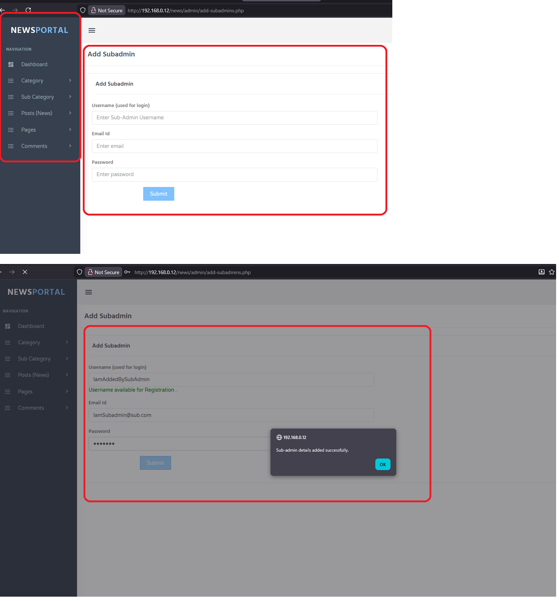
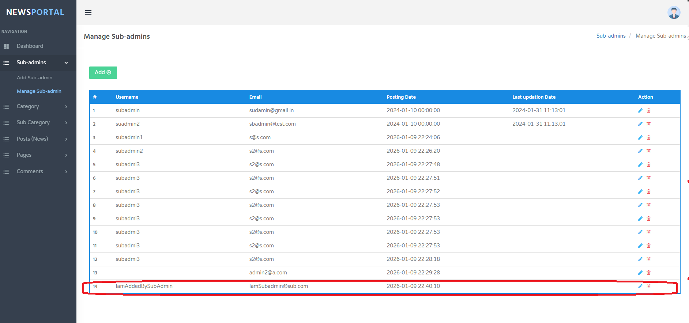

# CVE-2026-1141
## Broken Access Control – Privilege Escalation in News Portal Project in PHP and MySql in PHPGurukul

**Application:** News Portal Project (PHPGurukul)
 **Endpoint:** `/news/admin/add-subadmins.php`
 **Severity:** **High**
 **OWASP:** **A01:2021 – Broken Access Control**

**Product Link:** https://phpgurukul.com/news-portal-project-in-php-and-mysql/

------

### Description

The News Portal Project in PHP and MySql in PHPGurukul admin panel suffers from a **broken access control vulnerability** that allows a **sub-admin user to perform admin-only actions**. The endpoint used to create new sub-admin accounts is intended to be accessible only by users with **administrator privileges**. However, access control is enforced only at the UI level and not on the server side.

A sub-admin can directly access the admin-only endpoint and is able to create additional sub-admin accounts, resulting in **horizontal and vertical privilege escalation**.

------

### Affected Endpoint

```
http://192.168.0.12/news/admin/add-subadmins.php
```

------

### Proof of Concept (PoC)

1. Authenticate as a **sub-admin** user.

2. Manually browse to:

   ```
   /news/admin/add-subadmins.php
   ```

3. The application loads the **Add Sub-Admin** page without restriction.

4. Submit the form to successfully create a new sub-admin account.



**Expected Behavior:**
 Access should be denied to sub-admin users.

**Actual Behavior:**
 Sub-admin users can access the page and create new sub-admin accounts.



------

### Impact

- Privilege escalation from sub-admin to admin-equivalent capabilities
- Unauthorized creation of privileged accounts
- Loss of access control integrity
- Potential full compromise of the admin panel

------

### Root Cause

- Missing server-side authorization checks
- Role validation performed only in frontend/UI logic
- No verification of user role before executing admin-only functionality

------

### Recommendation

- Enforce **server-side role validation** on all admin-restricted endpoints
- Verify user role (e.g., `admin`) before allowing access or processing requests
- Deny access and return `403 Forbidden` for unauthorized roles

## Discovered By

* **Mo Asim** also known as **Asim Qazi**
* Github: @Asim-Qazi
* Linkedin: [Asim Qazi](https://www.linkedin.com/in/masimqazi)
* Student | Security Researcher
